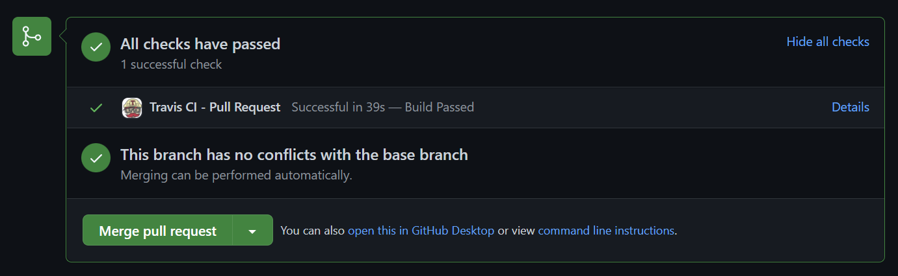
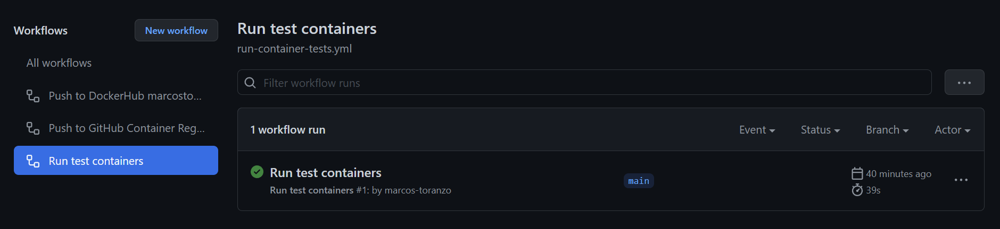

# Continuous Integration

In order to automatize the testing of the code developed and pushed into production, we needed to implement continuous integration systems. In this case, there were used two: Travis CI and an embedded GitHub Action.

## Travis CI

Travis offers a lot of advantages. First, it is free to use. This comes with a problem though. In its Free plan, we get to use it for free, but it requires the user to enter the credit card information, even though it won't charge any amount. This is explained by [Travis CI here Billing FAQ](https://docs.travis-ci.com/user/billing-faq/#:~:text=our%20billing%20overview.-,Why%20am%20I%20asked%20for%20credit%20card%20details%20upon%20selection,step%20for%20every%20new%20user.), saying that is a mechanism to avoid the recent abuse of their free plan. Instead of paying, the user will be provided with 10000 credits monthly, where a build operation on a Linux default system would cost 10 credits. This is why in the [.travis.yml](../.travis.yml) file is specified how Travis will only run when there are pushes on the main branch, to both save credits and only check production code, since the rest is not necessary to be checked. The second advantage of using Travis CI is its easy configuration and strong integration with GitHub. We only need to sign up in Travis and link our GitHub account and repository we want to install Travin in. Once this is done, we only have to specify the configuration in the [.travis.yml](../.travis.yml) file. This makes Travis extremely easy to use since with a few lines of code we can set it up and start using it.

For the configuration of the [.travis.yml](../.travis.yml) file, the instructions from this site [Building a Python Project](https://docs.travis-ci.com/user/languages/python/) were used, since it's the official documentation from Travis CI related to Python projects, exactly what we are looking for. First, we specify the language and the versions to use. In this case, version `3.9` was used because it is the most recent and stable that Travis supports correctly. Following the language and version, we specify that we only want to run the build process when changes are being pushed into the main branch. Afterward, we install the necessary software to run the tests; in this case, only `make`, the specific dependencies used by Python should be acquired in the `install` key. We do this in the key `before_install` in the `.yml` file. Later, we specify the requirements for the python environment by using pip. Finally, we run the tests, by writing the `script` key followed by the command; in this case, `make test`. And that's it. Easy and fast.

When the required conditions are met (in this case, when we push changes into main) the tests will run, and we can see the state of the build in our PR:

## GitHub Action

In this case GitHub action was selected due to the simplicity and easy integration with GitHub, besides, its structure is almost the same to the previously implemented for building and pushing the docker image to Docker Hub and the GitHub Container Registry. In this case what changes is that we need to install `make` since it is our task manager and runner, and finally call the rule `container-test` from the `Makefile` using `make`, running the tests in the docker container.

We can see this process under the Actions tab in out GitHub repository:

