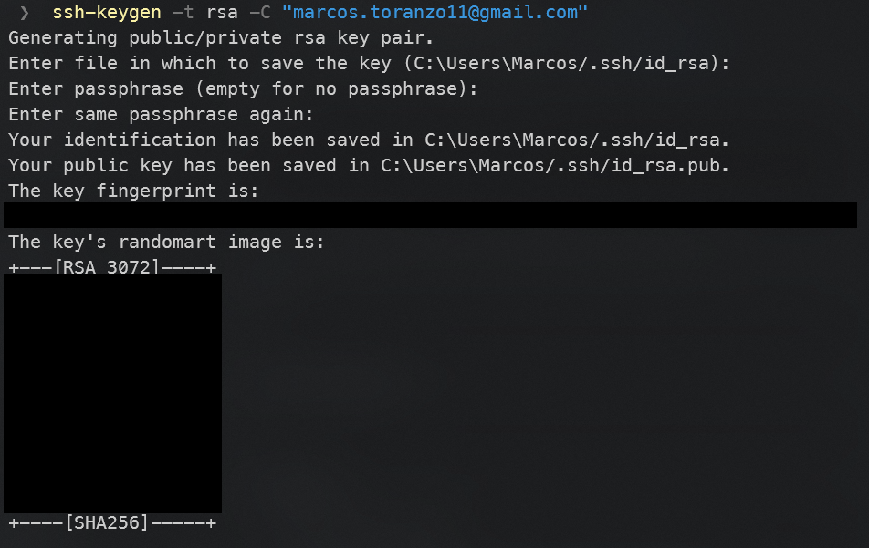

# SSH Configuration

In order to set up GitHub to work with SSH we need to follow these steps:

1. Generate the public and private key using `ssh-keygen`. In this case we are using rsa and passing the optional description with our email:

```bash
ssh-keygen -t rsa -C "marcos.toranzo11@gmail.com"
```

This will prompt some info in the terminal, asking us to enter the path in wich we wich to store the pair of keys, and the optional passphrase to use with this key:



In this case this generates 2 files based on the name you provided.

2. Now we need to head to our GitHub settings page and go to SSH and GPG Keys and click on the button New SSH Key. This will prompt a view to enter a short description for our key, as well as the public key. The latter can be found inside the `.pub` file generated in the prevoius step:


3. We click on Add SSH Key and we should see the information related to that key, like the fingerprint, added date and last time used:


</br>

# Configure git email and name

In order to state which developer wrote which commit, we need to set our information in two important git settings: the email and the name. To achieve this wee need to run the following commands in our terminal:

```bash
git config --global user.email "marcos.toranzo11@gmail.com"
git config --global user.name "Marcos Toranzo"
```

These command will set our email and name respectively. Notice how we used the flag `--global`, this states that this configuration will we used across all of our repos. If we want to use a different one in a specific project, we need to run those commands on the project directory, but omiting the `--global` flag:

```bash
git config user.email "marcos.toranzo11@gmail.com"
git config user.name "Marcos Toranzo"
```

To check if we set this correctly, we can run the command `git config --global --list` and see our configurations:


</br>

# Edit our GitHub profile

For this task we should head to our profile setting on GitHub, and change there the requested information, like name, email, bio, profile picture, etc.:


</br>

# Use two-factor authentication

In order for us to add this security measure, we need to go to GitHub setting -> Account Security. There we can find the setting for setting the two-factor authentication. We can choose to use either an app or an SMS. In our case we chose the app LastPass Authenticator.

When this process is finished we shuld see the last step indicating the successful operation:


